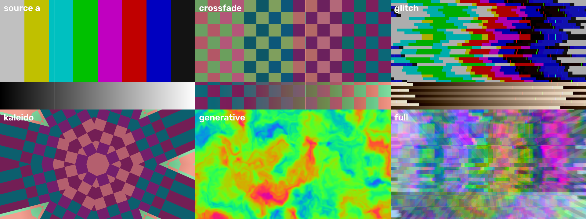

# vsynth

Software core for an audio-reactive video synthesizer — a standalone hardware
instrument for live performance, not a single-effect glitch box.

This repo is the **effects engine**, developed on a laptop ahead of the
hardware. Every visual effect is a GLSL fragment shader, so the same code moves
to whichever compute core the build settles on. Running it also answers the
question the hardware decision is currently blocked on: how much GPU work the
effects chain actually costs at 720p.



*Source A, a difference-mode crossfade between both inputs, and the glitch,
kaleidoscope, generative and full-chain looks — rendered headless by
`tools/preview.py`.*

## Status

All five effect families are in, both video inputs composite through a
modulatable crossfade, and audio and MIDI both drive parameters.

| Subsystem | State |
|---|---|
| Render chain (720p, 16-bit float, ping-pong + history) | working |
| Effects: glitch, kaleidoscope, generative, feedback, colour | working |
| Dual-source mixer, 5 blend modes | working |
| Master dry/wet + output level | working |
| Audio analysis (4 bands + transients, independent L/R) | working |
| MIDI CC routing + MIDI learn | working |
| MIDI clock sync (transport, tap tempo, 6 clock sources) | working |
| Scene recall (6 slots, soft takeover) | working |
| Sources: webcam, video file, test patterns | working |
| Sources: dual RGBS capture | hardware, not started |
| LED feedback / illuminated buttons | hardware, not started |

**Cost at 720p, all five effects plus mixer and master — seven passes:**

```
GPU render      2.26 ms/frame  (443 fps ceiling)
source (CPU)    0.15 ms/frame
total           2.41 ms/frame  -- 14% of the 60 fps budget
```

Measured on an Apple M2. Re-run `tools/preview.py` on candidate hardware before
reading anything into it — the point of the number is the comparison.

## Running it

```bash
python3 -m venv .venv && .venv/bin/pip install -r requirements.txt
```

```bash
.venv/bin/python -m vsynth
```

First launch asks for camera and microphone permission. Anything that will not
open falls back to a test pattern, so the instrument always starts.

See what hardware it found:

```bash
.venv/bin/python -m vsynth --list
```

### Sources

Both inputs are set independently. A source is `cam:N`, `file:PATH`, `bars` or
`grid`:

```bash
.venv/bin/python -m vsynth -a cam:0 -b file:~/clips/loop.mp4
```

Defaults are `-a cam:0 -b grid`. Also: `--audio "<device>"`,
`--midi "<port substring>"`.

### Controls

The finished panel has 24 pots, 3 long-throw faders, 12 illuminated buttons and
no screen. The keyboard here is scaffolding until that exists.

| Key | Action |
|---|---|
| `TAB` / `shift-TAB` | select control (stands in for "which pot") |
| arrows | adjust selected control (hold shift for fine) |
| `1`–`5` | bypass glitch / kaleidoscope / generative / feedback / colour |
| `M` | cycle the selected control's modulation source |
| `[` `]` | modulation depth down / up |
| `L` | MIDI learn — then move a control on your controller |
| `K` | clear MIDI bindings for the selected control |
| `F1`-`F6` | recall scene |
| `shift`+`F1`-`F6` | store scene (writes to disk immediately) |
| `R` | revert to the active scene, discarding edits |
| `T` | soft takeover on/off |
| `S` | save MIDI bindings |
| `B` | tap tempo (four taps) — takes over from an external clock |
| `N` | reset to the downbeat |
| `X` | swap sources A and B |
| `P` | print the current patch |
| `ESC` | quit |

## How it fits together

```
source A ─┐
          ├─ mixer ─► dry ─► glitch ─► kaleido ─► generative ─► feedback ─► colour ─┐
source B ─┘            │                             ▲                              │
                       │                             │                           master ─► out
                       └──────── dry/wet ────────────┼──────────────────────────────┘
                                                  history ◄── previous frame
     audio ──► bands + transients ──┐
                                    ├──► parameters
     MIDI ──► CC ───────────────────┘
```

Both sources are digitised into the canvas *before* compositing, matching the
hardware decision — that is what lets audio and MIDI modulate the crossfade
itself rather than only the two sources underneath it.

Generative sits **before** feedback on purpose: generated content that feeds
back accumulates into structure, where blending it in afterwards would lay a
flat wash over everything.

### The parameter model

Everything meets at the parameter, which is the one idea worth understanding
before changing anything:

**A parameter's knob position is always 0..1** — literally what a pot reads.
Modulation is summed in that same normalised space, clamped, and only then
scaled to whatever range the shader wants. So a physical pot, a MIDI CC and an
audio band all write to the same place without any of them knowing the
parameter's units. Adding a control to the panel later changes no shader code.

Each parameter also declares whether it is a pot or a **fader**, so the panel
budget lives in code rather than a spreadsheet — `tools/smoke_test.py` fails the
build if the patch overruns 24 pots or 3 faders. The current patch spends
23 and 3.

The twelve illuminated buttons are spent the same way -- five effect bypasses,
tap tempo, and six scene slots -- and the smoke test fails the build if adding
an effect overruns that.

The three faders are the blends that deserve a long throw:

| Fader | Parameter | What it does |
|---|---|---|
| 1 | `mixer.xfade` | source A against source B |
| 2 | `generative.amount` | generated layer against the video |
| 3 | `master.wet` | the whole effects chain against clean picture |

### Audio

L and R are analysed **independently and never summed**, matching the hardware
decision that each signal path stays separately patchable. Modulation sources
are named `l.*`, `r.*` and `mix.*` — bands `bass`/`lowmid`/`mid`/`high` plus
`rms` and `hit` (transient). Band levels are auto-gained against a slowly
decaying peak, so a quiet synth patch and a hot drum bus drive the visuals
about equally. `master.audio` scales every modulation depth at once.

### Scenes

A scene holds every control position, every modulation routing, and which
effects are bypassed. It deliberately does **not** hold MIDI bindings, source
selection or tempo -- those belong to the rig and the gig, not to the look, and
having a scene change stamp on them mid-set is the kind of surprise a live
instrument cannot afford. Storing writes to disk immediately; on a panel with
no screen there would be nothing to show that a change was still uncommitted.

Over MIDI, notes 60-65 recall scenes 1-6 and notes 72-77 store them. Store sits
a deliberate octave away rather than behind a hold-timer, so it cannot fire by
accident during a performance.

**Soft takeover is the part that makes this work on hardware.** With 24 pots
each hardwired to one parameter, recalling a scene leaves every pot at the
wrong physical position for the value now loaded -- so the first knob touched
would snap its parameter to wherever that knob happens to be sitting. Instead a
control is ignored until it reaches or crosses the value it drives, at which
point it takes over smoothly. `pickup_status()` reports which way a waiting
control must move, for the panel LEDs to show. A control that was just moved to
teach a MIDI mapping is exempt -- it is already in the performer's hand.

Turn it off with `T` if you would rather have controls respond immediately.

### Clock

MIDI clock arrives at 24 pulses per quarter note — only 48 Hz at 120 BPM, below
the render rate. Advancing phase only on ticks therefore *stutters*, so phase is
interpolated between ticks against a median-filtered tempo estimate and merely
corrected by each tick. Tempo, start/stop/continue and song-position are all
followed; a stopped transport holds the picture rather than drifting.

With nothing plugged in the same phase free-runs from an internal tempo, so
clock modulation works on a bench with no MIDI attached. `B` taps a tempo and
takes manual control back — useful if a sender disappears mid-set — and `N`
resets the downbeat.

Six sources join the modulation matrix alongside the audio ones, so any control
can be driven from the grid:

| Source | Shape |
|---|---|
| `clk.beat` | ramp 0→1 each quarter note |
| `clk.bar` | ramp 0→1 each bar (4/4 assumed; MIDI clock carries no signature) |
| `clk.8th` / `clk.16th` | the same ramp at faster subdivisions |
| `clk.pulse` | decaying spike on each beat, for accents |
| `clk.tri` | triangle up and back, for motion that has to return |

Unlike the audio sources these are **not** scaled by `master.audio` — that knob
means "how hard do the visuals react to sound", and pulling it down should not
stall tempo-locked motion.

Glitch is locked to the grid without any patching: its tearing re-rolls on
sixteenths rather than at a free-running rate, so the artefacts land with the
music instead of sliding against it.

## Layout

```
vsynth/
  config.py            canvas size, sample rate, band edges
  app.py               window, render loop, keyboard
  engine/
    params.py          Param + ParamBank: knob position, modulation, presets
    effect.py          effect definition, GLSL loading, shared shader header
    chain.py           mixer, ping-pong effects, history, master
    patch.py           which stages exist, their defaults and panel order
    scenes.py          scene capture, recall, persistence and LED state
  shaders/
    mixer.frag         two sources -> canvas, 5 blend modes
    glitch.frag        block tearing, RGB separation, scanlines
    kaleido.frag       polar mirror fold
    generative.frag    domain-warped noise, makes picture from nothing
    feedback.frag      previous frame, warped and decayed
    color.frag         hue / saturation / gain / posterise
    master.frag        dry-wet against the canvas, output level
  audio/analyzer.py    FFT bands, transient detection, auto-gain
  midi/router.py       CC routing, MIDI learn, message dispatch
  midi/clock.py        tempo, transport, phase interpolation, tap tempo
  sources/video.py     webcam, video file, test patterns
tools/
  smoke_test.py        headless: compile shaders, verify every stage bites
  preview.py           headless: render stills, time CPU and GPU separately
  clock_test.py        clock timing against a synthetic tick stream
  scene_test.py        scene round trips and soft-takeover behaviour
```

## Adding an effect

1. Write `vsynth/shaders/<name>.frag`. The shared header already gives you
   `u_input`, `u_history`, `u_res`, `u_time`, `u_bands`, `u_hit`, `u_clock` and
   `hash21()`
   — declare only your own `u_<param>` uniforms.
2. Add an `Effect(...)` with its `ParamSpec` list in `engine/patch.py`.

Presets, MIDI learn and the modulation matrix pick it up with no further
wiring. Run the smoke test first — a GLSL compile error reads much better there
than as a black screen, and it also checks the new stage actually changes the
picture rather than merely compiling.

```bash
.venv/bin/python tools/smoke_test.py
```

## Porting notes

Shaders are GLSL 330 core but stay inside the GLES 3.0 feature set — no
compute, no dynamic sampler indexing, no `textureGather`. Moving to a Pi-class
GPU should mean changing `VERSION_HEADER` in `engine/effect.py` to
`#version 300 es` and adding precision qualifiers, not rewriting effects.

Hardware constants live in `config.py` so the prototype and the eventual
carrier board agree on the same numbers.

When benchmarking, keep source generation and GPU time separate. Folding them
into one number once hid a 7 ms CPU cost in a test pattern behind what looked
like a GPU result.
